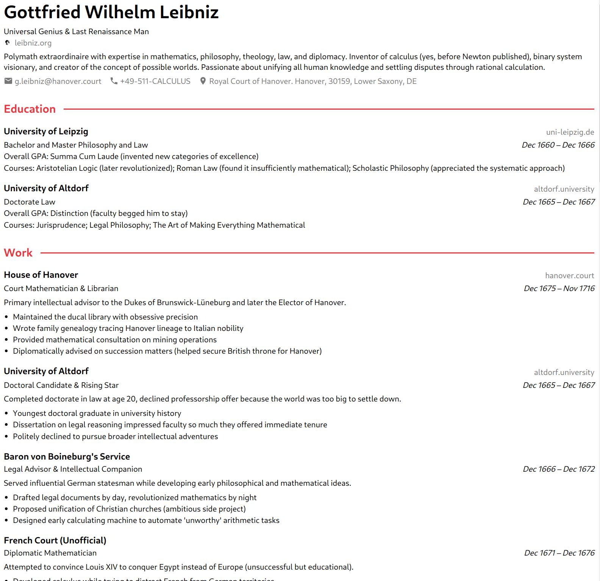
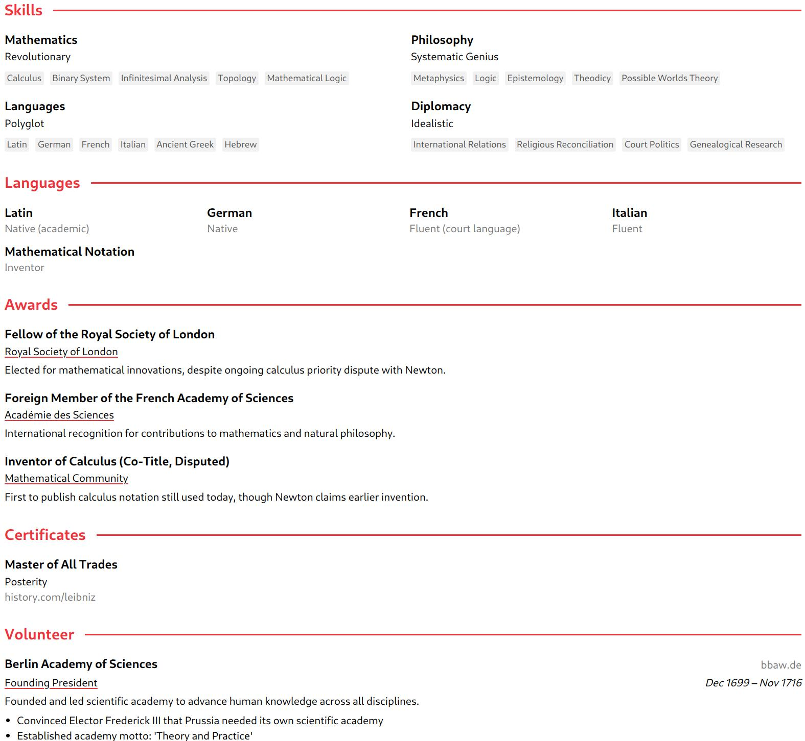

# JSON Resume Theme: Awesomeish

A clean, modern, and condensed JSON Resume theme heavily "inspired" by [Awesome-CV](https://github.com/posquit0/Awesome-CV) and [jsoncv](https://github.com/reorx/jsoncv) 




## Features

- **Modern Styling**: Clean typography and professional appearance
- **Responsive Layout**: Works great on desktop and mobile devices
- **Smart Grouping**: Conditional underlines for multiple positions at the same company
- **Condensed Design**: Optimized sections like languages and skills for better space usage
- **Complete `jsonresume` schema support**: All standard resume sections supported


## Installation & Usage

```bash

# in your CV project
npm install https://github.com/ylanallouche/jsonresume-theme-awesomish
resume export --theme awesomeish output.html
resume export --theme awesomeish output.pdf

```

### Customization

You can customize the theme by:

1. **Colors**: Edit CSS variables in `style.css`
   ```css
   :root {
     --color-primary: #ed333b; /* Change accent color */
   }
   ```

2. **Layout**: Modify `resume.handlebars` template structure

3. **Styling**: Update `style.css` for typography, spacing, etc.

4. **Logic**: Add custom Handlebars helpers in `index.js`

## License

MIT License - see LICENSE file for details.
